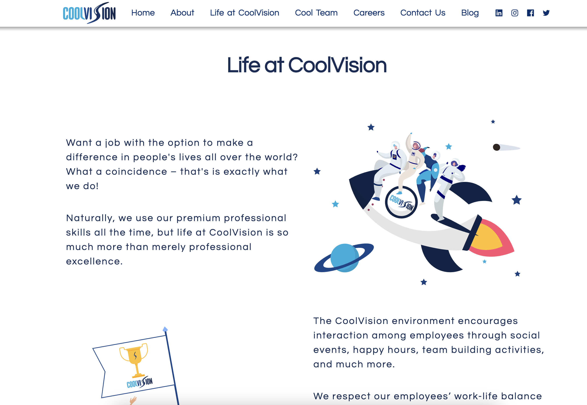

# CoolVision Landing Page:



# CoolVision Landing Page Clone

This project is a clone of the existing CoolVision landing page, built using React and styled with Tailwind CSS.

## Technologies Used

- React
- Tailwind CSS

## Getting Started

To get started with the project, follow these steps:

1. Clone this repository to your local machine:

```bash
   https://github.com/your-username/coolvision-landing-page-clone.git
```

2. Navigate to the project directory:

```bash
   cd coolvision-landing-page-clone
```

3. Install dependencies using npm install.


3. Start localhost using npm run dev
